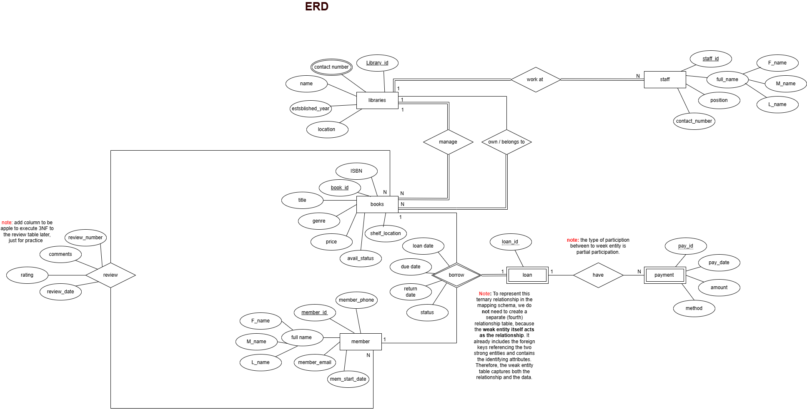
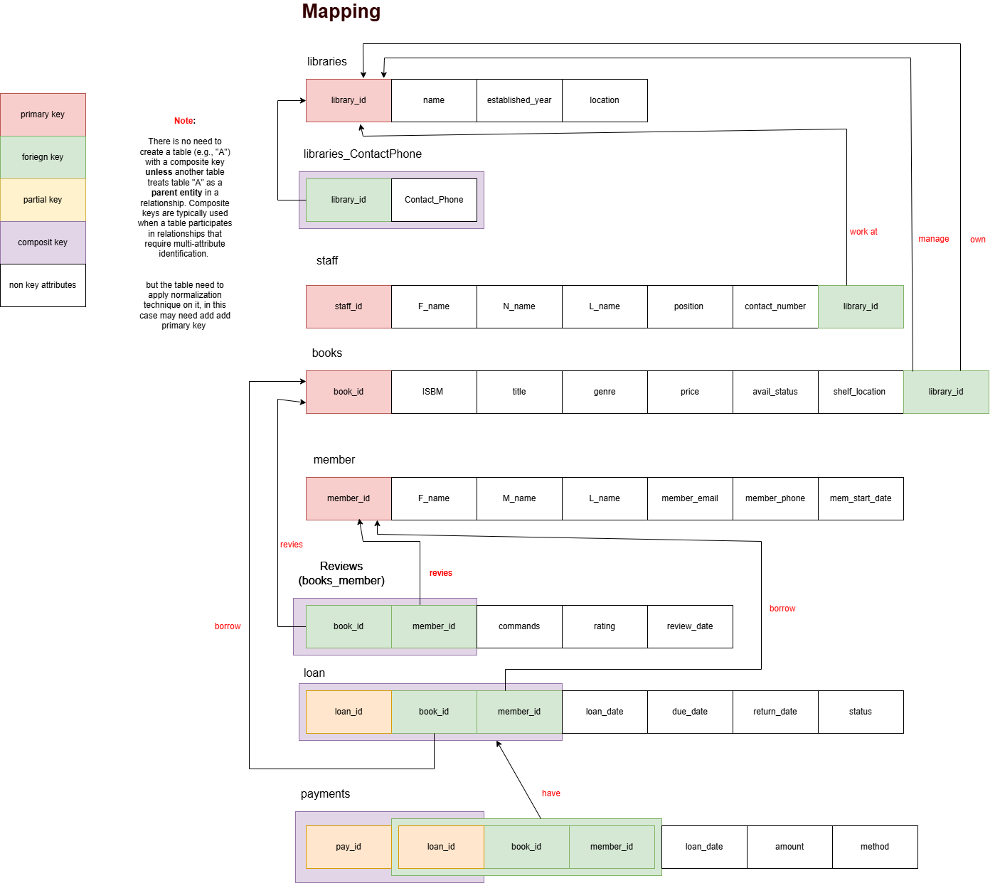
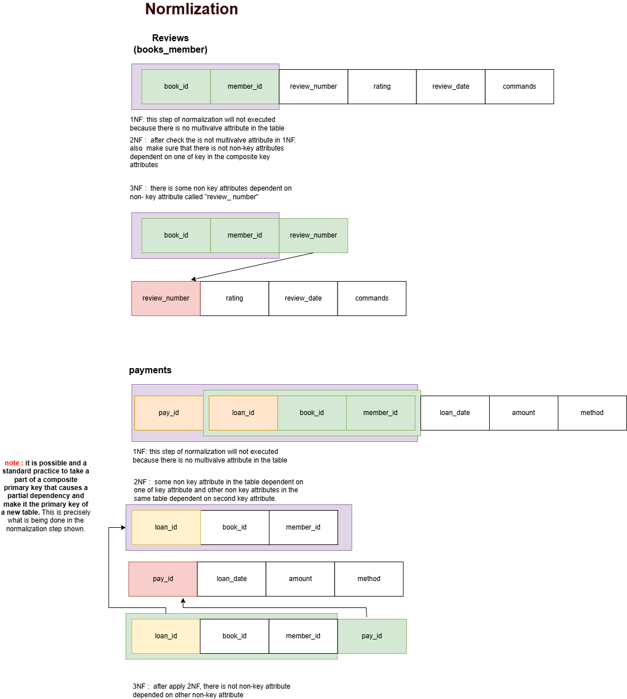

# Library Management System DB
## Project Overview
The Library Management System is a database project designed to manage the operations of a library. The system will allow users to perform various tasks such as adding new books, checking out books, returning books, and managing user accounts. The project will be implemented using SQL and will include a user-friendly interface for easy interaction with the database.
## Project Requirements
The Library Management System is designed to manage books, members, staff, loans, and transactions efficiently. The system includes libraries where each library has a unique ID, name, location, contact number, and established year. Each library must manage books, where each book is identified by a unique ID, ISBN, title, genre, price, availability status, and shelf location. A book belongs to exactly one library, and a library may own many books. Members can register with personal information such as ID, full name, email, phone number, and membership start date. A member can borrow zero or more books. Each loan links one member with one book and includes loan date, due date, return date, and status. Each loan may have zero or more fine payments, where a payment is uniquely identified and includes payment date, amount, and method. Payment always corresponds to one specific loan. Staff work at a specific library, identified by staff ID, full name, position, and contact number. Each library must have at least one staff member, but each member of staff works at only one library. Members may also review books, where a review includes a rating, comments, and review date. Each review is linked to a specific book and a specific member. A member can provide multiple reviews, and a book may receive many reviews.
## Entity-Relationship Diagram (ERD)
 
## Database Schema (Map the ERD to Relational Schema)

## Normalization

## SQL Queries
### 1. Create Tables
```

```
### Error-Based Learning (Live Testing Phase) 
#### Try deleting a member who: 
• Has existing loans 

• Has written book reviews 
```
DELETE FROM member WHERE member_id=2;
```
#### Try deleting a book that: 
• Is currently on loan 

• Has multiple reviews attached to it
```
delete from books where book_id =10;

```

#### Try inserting a loan for: 
• A member who doesn’t exist 

• A book that doesn’t exist 
```
INSERT INTO loan (loan_id, book_id, member_id, loan_date, due_date, return_date, status)
VALUES
(10, 6,6, '2025-05-03', '2025-05-17', '2025-05-17', 'returned');
```
#### Try updating a book’s genre to: 
• A value not included in your allowed genre list (e.g., 'Sci-Fi') 
```
UPDATE books 
SET genre = 'Sci-Fi'
WHERE book_id = 1;
```

error 
```
The UPDATE statement conflicted with the CHECK constraint "chk_genre". The conflict occurred in database "LibrarySystem", table "dbo.books", column 'genre'.

```

solve
```
UPDATE books 
SET genre = 'Reference'
WHERE book_id = 1;

```
####  Try inserting a payment with: 
• A zero or negative amount 

• A missing payment method 
```
INSERT INTO Payments (pay_id, loan_date, amount, method)
VALUES
(6, '2025-05-01', 0, 'cash');
```
error

```
The INSERT statement conflicted with the CHECK constraint "CK__Payments__amount__52593CB8". The conflict occurred in database "LibrarySystem", table "dbo.Payments", column 'amount'.
```

solve
```
INSERT INTO Payments (pay_id, loan_date, amount, method)
VALUES
(6, '2025-05-01', 1.00, 'cash');

```

#### Try inserting a review for: 
• A book that does not exist 

• A member who was never registered
```
INSERT INTO MemberBookReviews (book_id, member_id, review_number) VALUES
(10, 5, 1);

```
error

```
The INSERT statement conflicted with the FOREIGN KEY constraint "FK__MemberBoo__book___5812160E". The conflict occurred in database "LibrarySystem", table "dbo.books", column 'book_id'.
```

solve
```
INSERT INTO MemberBookReviews (book_id, member_id, review_number) VALUES
(8, 5, 1);
```

### Try updating a foreign key field (like MemberID in Loan) to a value that doesn’t exist.
```


``` 

