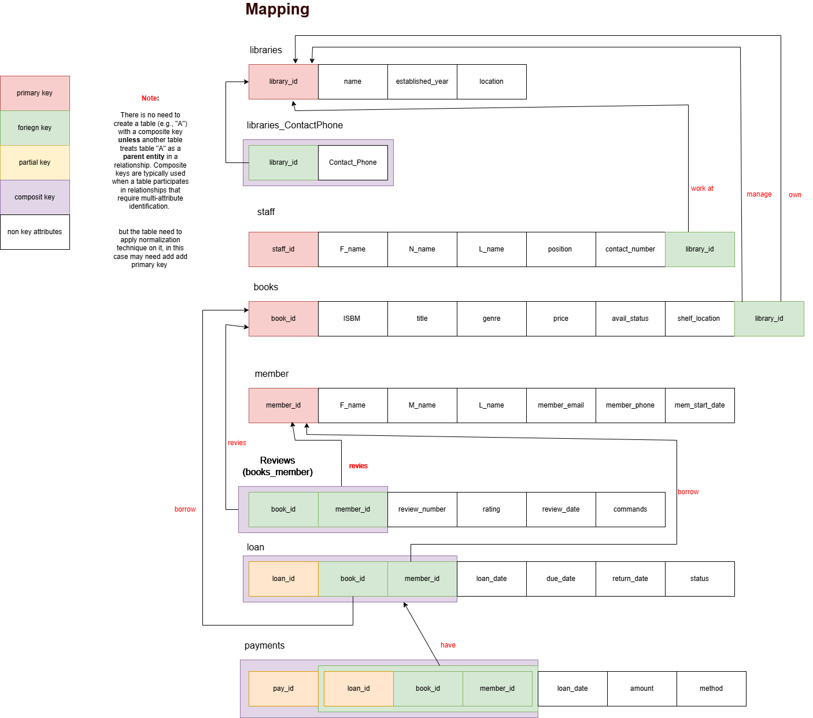

# Library Management System DB
## Project Overview
The Library Management System is a database project designed to manage the operations of a library. The system will allow users to perform various tasks such as adding new books, checking out books, returning books, and managing user accounts. The project will be implemented using SQL and will include a user-friendly interface for easy interaction with the database.
## Project Requirements
The Library Management System is designed to manage books, members, staff, loans, and transactions efficiently. The system includes libraries where each library has a unique ID, name, location, contact number, and established year. Each library must manage books, where each book is identified by a unique ID, ISBN, title, genre, price, availability status, and shelf location. A book belongs to exactly one library, and a library may own many books. Members can register with personal information such as ID, full name, email, phone number, and membership start date. A member can borrow zero or more books. Each loan links one member with one book and includes loan date, due date, return date, and status. Each loan may have zero or more fine payments, where a payment is uniquely identified and includes payment date, amount, and method. Payment always corresponds to one specific loan. Staff work at a specific library, identified by staff ID, full name, position, and contact number. Each library must have at least one staff member, but each member of staff works at only one library. Members may also review books, where a review includes a rating, comments, and review date. Each review is linked to a specific book and a specific member. A member can provide multiple reviews, and a book may receive many reviews.
## Entity-Relationship Diagram (ERD)
 
## Database Schema (Map the ERD to Relational Schema)

## Normalization

## SQL Queries
### 1. create database 
create database 

```
-- ========= create database =======
create database LibrarySystem

-- ========== use database ========
use LibrarySystem
--   ======== create tables =========

```
### 2. Use DDL commands to create the physical schema.
Write SQL scripts that:
- Create all tables using appropriate data types
- Set IDs as IDENTITY
- Define PKs, FKs (ON DELETE CASCADE, ON UPDATE CASCADE)
- Apply constraints: NOT NULL, UNIQUE, CHECK, and DEFAULT
- Genre values: 'Fiction', 'Non-fiction', 'Reference', 'Children'
- Loan status: 'Issued', 'Returned', 'Overdue'
- Prices and amounts > 0
- Rating between 1 and 5
- Defaults: IsAvailable = TRUE, LoanStatus = 'Issued', ReviewComments = 'No 
comments'

```
-- ========= create database =======
create database LibrarySystem

-- ========== use database ========
use LibrarySystem
--   ======== create tables =========

-- Libraries table
create table libraries
(
library_id int primary key IDENTITY,
name varchar(10) not null UNIQUE, 
established_year varchar(4) not null,
location varchar(20) not null
);

create table library_ContactPhone
(
library_id int not null,
Contact_phone varchar(8) not null
primary key(library_id, Contact_phone)
);

create table staff
(
staff_id int primary key IDENTITY,
F_name varchar(8) not null,
N_name varchar(8) not null,
L_name varchar(8) not null, 
position varchar(20) not null,
contact_number varchar(8) not null, 
library_id int not null
);


create table books
(
book_id int primary key identity,
ISBM int not null unique,
title varchar(20) unique not null,
genre VARCHAR(20) not null,
CONSTRAINT chk_genre CHECK (Genre IN ('Fiction', 'Non-fiction', 'Reference', 'Children')),
price decimal (6,3) not null check (price > 000.000),
avail_status BIT DEFAULT 1,               -- 1 = TRUE
shelf_location  varchar(10) not null, 
library_id int not null
);

create table member
(
member_id int primary key identity,
F_name varchar(10) not null, 
M_name varchar(10) not null, 
L_name varchar(10) not null, 
member_email varchar(20) not null unique,
member_phone varchar(20) not null unique, 
mem_start_date date not null
);

create table MemberBookReviews
(
book_id int not null,
member_id int not null,
review_number int not null,
primary key(book_id, member_id)
);

create table reviews
(
review_number int primary key identity,
rating decimal (2,1) not null,
review_date date not null,
commands varchar(255) not null DEFAULT 'No comments'
);

create table loan
(
loan_id int not null, 
book_id int not null,
member_id int not null,
loan_date date not null,
due_date date not null,
return_date date not null,
status varchar(10) not null default 'issued',
primary key(loan_id, book_id, member_id)
);

create table BookLoans
(
loan_id int not null,
book_id int not null,
member_id int not null
primary key(loan_id, book_id, member_id)
);

create table Payments
(
pay_id int primary key,
loan_date date not null,
amount decimal (6,3) not null check(amount > 000.000),
method varchar(10) not null
);

create table loan_pay
(
loan_id int not null,
pay_id int not null,
book_id int not null,
member_id int not null
);
-- ================================== foriegn key ====================
-- libraries_contactPhone table
alter table library_ContactPhone
add foreign key (library_id) references libraries(library_id) on delete cascade on update cascade

-- staff table 
alter table staff
add foreign key (library_id) references libraries(library_id) on delete cascade on update cascade

-- books table 
alter table books
add foreign key (library_id) references libraries(library_id) on delete cascade on update cascade

-- Reviews (books_member) table 
alter table MemberBookReviews
add foreign key (member_id) references member(member_id) on delete cascade on update cascade

-- Reviews (books_member) table 
alter table MemberBookReviews
add foreign key (book_id) references books(book_id) on delete cascade on update cascade

-- Reviews (books_member) table 
alter table MemberBookReviews
add foreign key (review_number) references reviews(review_number) on delete cascade on update cascade

-- loan table 
alter table loan
add foreign key (book_id) references books(book_id) on delete cascade on update cascade

-- loan table 
alter table loan
add foreign key (member_id) references member(member_id) on delete cascade on update cascade

-- BookLoans table
alter table BookLoans
add foreign key (loan_id, book_id, member_id) references loan(loan_id, book_id, member_id) on delete cascade on update cascade

-- loan_pay table 
alter table loan_pay
add foreign key (loan_id, book_id, member_id) references BookLoans(loan_id, book_id, member_id) on delete cascade on update cascade

alter table loan_pay
add foreign key (pay_id) references Payments(pay_id) on delete cascade on update cascade


```


### 3. Insert real-world data
Minimum required data:

- 2–3 Libraries
-  10+ Books
-  6+ Members
- 8–10 Loans
- 4+ Payments
- 4+ Staff
- 6+ Reviews

Use DML to simulate real application behavior:
- Mark books as returned
- Update loan status
- Delete reviews/payments
```
USE LibrarySystem

-- insert values to libraries table
INSERT INTO libraries (name, established_year, location) VALUES
('NPL', '1975', 'Muscat'),
('SQU Lib', '1986', 'Al Khoudh'),
('SalalahLib', '1992', 'Salalah');

--display all data in libraries table 
select * from libraries

-- insert values to library_ContactPhone table 
INSERT INTO library_ContactPhone (library_id, Contact_phone) VALUES
(1, '24812345'),
(1, '24867890'),
(2, '24141234'),
(3, '23219876');

-- display all data in library_ContactPhone table
select * from library_ContactPhone

-- insert values staff table 
INSERT INTO staff (F_name, N_name, L_name, position, contact_number, library_id) VALUES
('Ali', 'Saeed', 'AlBalushi', 'Librarian', '99881234', 1),
('Maha', 'Hamed', 'AlHinai', 'Assistant', '99221100', 1),
('Ahmed', 'Salim', 'AlShanfari', 'Manager', '92334455', 2),
('Fatma', 'Nasser', 'AlBusaidi', 'Technician', '94775566', 3);

-- change size of F_name, M_name, L_name 
ALTER TABLE staff
ALTER COLUMN F_name VARCHAR(20);

ALTER TABLE staff
ALTER COLUMN N_name VARCHAR(20);

ALTER TABLE staff
ALTER COLUMN L_name VARCHAR(20);

-- insert value to book table, in avail_status : 1 means book in available (returned) , 0 means book is still loaded (borrow)
INSERT INTO books (ISBM, title, genre, price, avail_status, shelf_location, library_id) VALUES
(9781001, 'Desert Tales', 'Fiction', 4.500, 1, 'A1', 1),
(9781002, 'Oman History', 'Non-fiction', 6.750, 1, 'B2', 1),
(9781003, 'Math Guide', 'Reference', 3.250, 1, 'C3', 2),
(9781004, 'Science Fun', 'Children', 2.800, 1, 'D1', 2),
(9781005, 'Falaj Story', 'Fiction', 5.000, 0, 'A3', 3),
(9781006, 'World Atlas', 'Reference', 7.950, 1, 'C1', 3),
(9781007, 'Think Big', 'Non-fiction', 4.400, 1, 'B1', 3),
(9781008, 'Quran Kids', 'Children', 3.000, 1, 'D2', 1),
(9781009, 'Oman Myths', 'Fiction', 4.200, 0, 'A2', 1),
(9781010, 'Enviro Facts', 'Non-fiction', 6.100, 1, 'B3', 2);
select * from books

-- insert values to member table 
INSERT INTO member (F_name, M_name, L_name, member_email, member_phone, mem_start_date) VALUES
('Ali', 'Saeed', 'AlHarthy', 'ali.h@gmail.com', '99881234', '2023-01-15'),
('Maha', 'Ahmed', 'AlRaisi', 'maha.r@gmail.com', '99112233', '2023-03-20'),
('Salim', 'Nasser', 'AlBusaidi', 'salim.b@gmail.com', '99334455', '2023-05-10'),
('Fatma', 'Khalid', 'AlLawati', 'fatma.l@gmail.com', '99445566', '2023-07-01'),
('Hamed', 'Yousuf', 'AlFarsi', 'hamed.f@gmail.com', '99556677', '2023-08-25'),
('Aisha', 'Said', 'AlAbri', 'aisha.a@gmail.com', '99667788', '2023-10-02'),
('Nasser', 'Ali', 'AlHinai', 'nasser.h@gmail.com', '99778899', '2023-11-18');
select * from member

-- insert values to reviews table 
INSERT INTO reviews (rating, review_date, commands)
VALUES 
(4.5, '2025-05-10', 'Excellent and fast service. I thank the team for their assistance'),
(3.0, '2025-05-12', 'Very satisfied with the experience. I recommend dealing with them, especially in Muscat.'),
(5.0, '2025-05-14', 'The experience was below expectations. I hope they improve the quality of technical support.'),
(2.5, '2025-05-15', 'Good service. The staff is cooperative and understanding.'),
(4.0, '2025-05-17', 'Good service. The staff is cooperative and understanding.');
select * from reviews


-- insert values to MemberBookReviews table 
INSERT INTO MemberBookReviews (book_id, member_id, review_number) VALUES
(1, 5, 1),
(10, 6, 2),
(2, 5, 3),
(1, 3, 4),
(3, 7, 5),
(2, 2, 5);

-- it is not possible to have two members same review at same time so we have put review_number as unique 
alter table MemberBookReviews
ADD CONSTRAINT RN_UNIQUE UNIQUE(review_number);
-- drop the constrains 
ALTER TABLE MemberBookReviews
DROP CONSTRAINT RN_UNIQUE;


-- inseart values to payments table 
INSERT INTO Payments (pay_id, loan_date, amount, method)
VALUES
(1, '2025-05-01', 2.500, 'cash'),
(2, '2025-05-03', 1.750, 'card'),
(3, '2025-05-07', 3.000, 'online'),
(4, '2025-05-10', 2.250, 'cash'),
(5, '2025-05-12', 4.100, 'card');


-- inseart values to loan table 
INSERT INTO loan (loan_id, book_id, member_id, loan_date, due_date, return_date, status)
VALUES
(1, 1, 1, '2025-05-01', '2025-05-15', '2025-05-14', 'returned'),
(2, 2, 1, '2025-05-03', '2025-05-17', '2025-05-17', 'returned'),
(3, 3, 2, '2025-05-05', '2025-05-19', '2025-05-20', 'returned'),
(4, 4, 4, '2025-05-07', '2025-05-21', '2025-05-19', 'returned'),
(5, 5, 3, '2025-05-10', '2025-05-24', '2025-05-23', 'returned'),
(6, 6, 3, '2025-05-12', '2025-05-26', '2025-05-26', 'returned'),
(7, 7, 7, '2025-05-15', '2025-05-29', '2025-05-28', 'returned'),
(8, 8, 5, '2025-05-17', '2025-05-31', '2025-05-31', 'returned'),
(9, 9, 5, '2025-05-18', '2025-06-01', '2025-06-01', 'returned'),
(10,10, 4, '2025-05-19', '2025-06-02', '2025-06-03', 'returned');

select * from Payments

-- inseart values to BookLoan 
INSERT INTO BookLoans (loan_id, book_id, member_id)
VALUES
(1, 1, 1),
(2, 2, 1),
(3, 3, 2),
(4, 4, 4),
(5, 5, 3),
(6, 6, 3);

-- inseart tables to loan_pay
INSERT INTO loan_pay (loan_id, pay_id, book_id, member_id)
VALUES
(1, 1, 1, 1),
(2, 2, 2, 1),
(3, 3, 3, 2);

-- Use DML to simulate real application behavior: 
-- Mark books as returned 
update books
set avail_status = 1
where ISBM = 9781005;

-- Update loan status 
UPDATE loan
SET status = 'Issued'
WHERE loan_id = 5;

select * from loan

-- Delete reviews/payments
DELETE FROM Reviews
WHERE review_number = 11;

select * from Reviews

DELETE FROM Payments
WHERE pay_id = 3;

select * from Payments

```
### 4. Error-Based Learning (Live Testing Phase) 
#### Try deleting a member who: 
• Has existing loans 

• Has written book reviews 
```
DELETE FROM member WHERE member_id=2;
```
#### Try deleting a book that: 
• Is currently on loan 

• Has multiple reviews attached to it
```
delete from books where book_id =10;

```

#### Try inserting a loan for: 
• A member who doesn’t exist 

• A book that doesn’t exist 
```
INSERT INTO loan (loan_id, book_id, member_id, loan_date, due_date, return_date, status)
VALUES
(10, 6,6, '2025-05-03', '2025-05-17', '2025-05-17', 'returned');
```
#### Try updating a book’s genre to: 
• A value not included in your allowed genre list (e.g., 'Sci-Fi') 
```
UPDATE books 
SET genre = 'Sci-Fi'
WHERE book_id = 1;
```

error 
```
The UPDATE statement conflicted with the CHECK constraint "chk_genre". The conflict occurred in database "LibrarySystem", table "dbo.books", column 'genre'.

```

solve
```
UPDATE books 
SET genre = 'Reference'
WHERE book_id = 1;

```
####  Try inserting a payment with: 
• A zero or negative amount 

• A missing payment method 
```
INSERT INTO Payments (pay_id, loan_date, amount, method)
VALUES
(6, '2025-05-01', 0, 'cash');
```
error

```
The INSERT statement conflicted with the CHECK constraint "CK__Payments__amount__52593CB8". The conflict occurred in database "LibrarySystem", table "dbo.Payments", column 'amount'.
```

solve
```
INSERT INTO Payments (pay_id, loan_date, amount, method)
VALUES
(6, '2025-05-01', 1.00, 'cash');

```

#### Try inserting a review for: 
• A book that does not exist 

• A member who was never registered
```
INSERT INTO MemberBookReviews (book_id, member_id, review_number) VALUES
(10, 5, 1);

```
error

```
The INSERT statement conflicted with the FOREIGN KEY constraint "FK__MemberBoo__book___5812160E". The conflict occurred in database "LibrarySystem", table "dbo.books", column 'book_id'.
```

solve
```
INSERT INTO MemberBookReviews (book_id, member_id, review_number) VALUES
(8, 5, 1);
```

### Try updating a foreign key field (like MemberID in Loan) to a value that doesn’t exist.
```


``` 

